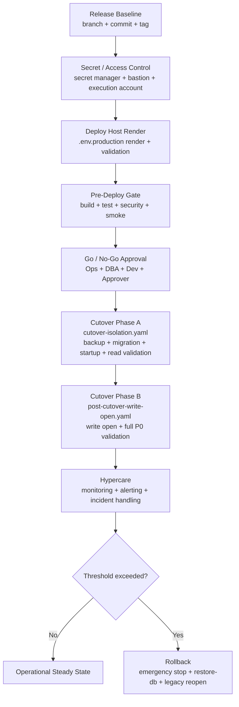

# Production Operating Model

## Scope
- Baseline branch: `feature/to-be-dev-env-bootstrap`
- Runtime baseline: `850c83c50fc2fb908f25c45affdce50a7ca72180`
- Release tag: `v2026.03.17-scm-rft-operational-go`
- System brand: `Mate-SCM`
- Purpose: define the operating model required to run SCM_RFT in actual production with controlled release, cutover, monitoring, and rollback.

## 1) Operating Model Overview


## 2) Operating Principles
1. Production deployment runs only from the frozen baseline commit and release tag.
2. `.env.production` is rendered only on the approved deploy host from the approved secret source.
3. Actual secret values are never written to Git, chat, or approval documents.
4. Gateway policy starts with `cutover-isolation.yaml` and switches to `post-cutover-write-open.yaml` only after the write-open checkpoint.
5. Rollback criteria are predeclared. Do not improvise rollback conditions during cutover.
6. Every rehearsal, pre-deploy run, and cutover execution must leave a RunId-based evidence trail.

## 3) Roles and RACI
| Role | Key Responsibility | Decision Authority | Core Evidence |
|---|---|---|---|
| Dev Owner | application runtime, smoke/P0 validation, defect triage | technical go/no-go input | `go-nogo-signoff.md`, smoke logs |
| Ops Owner | deploy host access, runtime startup/shutdown, gateway policy application | cutover execution control | cutover run logs, access evidence |
| DBA | backup, restore, migration confirmation, rollback data integrity | backup/restore decision input | backup path, restore proof, migration logs |
| Security/Ops | secret source approval, execution account approval | secret access approval | secret-source access evidence |
| Go/No-Go Approver | final business/operations release decision | final go/no-go | signed decision note |
| Hypercare Owner | immediate post-cutover monitoring and escalation | incident escalation | monitoring dashboard links, alert timeline |

## 4) Required Operational Inputs
These values must be fixed before actual production cutover starts.

### 4.1 Secret / Access Inputs
- secret manager type
- secret location/path/name
- access client
- read approver
- render operator
- deploy host or bastion
- access method (`WinRM` / `SSH` / approved runner)
- execution account

### 4.2 Runtime / Ownership Inputs
- production DB name
- DBA backup owner
- DBA restore owner
- Ops cutover owner
- Go/No-Go approver
- maintenance window start/end
- escalation channel

Canonical source:
- [production-secret-access-confirmation.md](C:\Users\CMN-091\projects\SCM_RFT\runbooks\production-secret-access-confirmation.md)

## 5) Configuration and Secret Management Model
1. Secret source is the single source of truth for production values.
2. `.env.production` is created on the deploy host only.
3. Validation is mandatory before cutover:
```powershell
Set-Location C:\Users\CMN-091\projects\SCM_RFT
git ls-files .env.production
powershell -ExecutionPolicy Bypass -File .\scripts\check-prod-secrets.ps1 -EnvFile .env.production
```
4. Required keys are governed by [check-prod-secrets.ps1](C:\Users\CMN-091\projects\SCM_RFT\scripts\check-prod-secrets.ps1).
5. `GATEWAY_POLICY_PATH` must default to `infra/gateway/policies/cutover-isolation.yaml` for cutover start.

## 6) Release and Pre-Deploy Control Model
Before actual cutover, the target baseline must satisfy:
1. frozen baseline and release tag updated
2. final pre-deploy gates PASS
3. production-like or actual-topology rehearsal evidence available
4. rollback runbook and owners confirmed
5. latest release note shared

Primary references:
- [operational-baseline-freeze.md](C:\Users\CMN-091\projects\SCM_RFT\runbooks\operational-baseline-freeze.md)
- [final-predeploy-gates.md](C:\Users\CMN-091\projects\SCM_RFT\runbooks\final-predeploy-gates.md)
- [go-nogo-signoff.md](C:\Users\CMN-091\projects\SCM_RFT\runbooks\go-nogo-signoff.md)
- [release-note.md](C:\Users\CMN-091\projects\SCM_RFT\runbooks\release-note.md)

## 7) Cutover Execution Model
### 7.1 Phase A: Isolation / Read Validation
Policy:
- `infra/gateway/policies/cutover-isolation.yaml`

Sequence:
1. announce cutover start
2. confirm latest backup
3. freeze write traffic
4. execute final migration
5. run `prod-up.ps1`
6. verify service health
7. run read/auth/member/order-lot smoke validation

### 7.2 Phase B: Write Open / Full P0 Validation
Policy:
- `infra/gateway/policies/post-cutover-write-open.yaml`

Sequence:
1. switch gateway policy
2. restart or reload gateway as approved
3. run full P0 smoke
4. confirm no 5xx spike or auth anomaly
5. open standard traffic

Primary references:
- [cutover-day-runbook.md](C:\Users\CMN-091\projects\SCM_RFT\runbooks\cutover-day-runbook.md)
- [production-cutover-execution-checklist.md](C:\Users\CMN-091\projects\SCM_RFT\runbooks\production-cutover-execution-checklist.md)
- [actual-cutover-topology-rehearsal-runbook.md](C:\Users\CMN-091\projects\SCM_RFT\runbooks\actual-cutover-topology-rehearsal-runbook.md)

## 8) Monitoring and Hypercare Model
Mandatory watch items:
1. gateway 4xx / 5xx
2. auth failure spike
3. service health `UP/DOWN`
4. p95 / p99 latency
5. DB timeout / deadlock
6. broker backlog
7. rollback trigger thresholds

Hypercare rules:
1. first 1 to 2 hours after cutover are treated as controlled hypercare
2. alert channel must be active before traffic open
3. every P0 failure must be linked to trace id and timestamp

Reference:
- [hypercare-rollback-monitoring-checklist.md](C:\Users\CMN-091\projects\SCM_RFT\runbooks\hypercare-rollback-monitoring-checklist.md)

## 9) Incident and Rollback Model
Immediate rollback triggers:
1. migration critical mismatch
2. required service remains `DOWN`
3. P0 smoke FAIL after approved retry policy
4. sustained 5xx / latency / auth failure beyond threshold

Rollback sequence:
1. apply emergency stop on gateway
2. execute `restore-db.ps1`
3. reopen legacy path if approved
4. record decision timeline and evidence

Primary references:
- [rollback-playbook.md](C:\Users\CMN-091\projects\SCM_RFT\runbooks\rollback-playbook.md)
- [production-cutover-execution-checklist.md](C:\Users\CMN-091\projects\SCM_RFT\runbooks\production-cutover-execution-checklist.md)

## 10) Evidence and Audit Model
Each execution must leave:
1. RunId
2. gate logs
3. migration log
4. smoke/P0 validation logs
5. decision summary
6. signoff record

Evidence locations:
- `runbooks/evidence/<RunId>/`
- `runbooks/evidence-manifest/`

## 11) Current Gap to Actual Production Execution
Development and local/actual-topology rehearsal are complete enough to support production operations, but actual production execution is still blocked until these are fixed:
1. secret manager type/path approved
2. deploy host or bastion approved
3. execution account approved
4. production DB name fixed
5. DBA/Ops/approver names fixed
6. maintenance window fixed

Until these are filled, actual production cutover must remain blocked.

## 12) Recommended Next Actions
1. fill [production-secret-access-confirmation.md](C:\Users\CMN-091\projects\SCM_RFT\runbooks\production-secret-access-confirmation.md) with real operational metadata
2. render `.env.production` on the approved deploy host
3. rerun cutover entry check
4. execute cutover runbook only after all entry criteria are marked done
